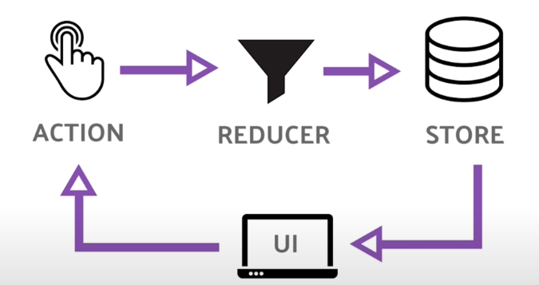

# useReducer

Su comportamiento es bastante parecido al _setState_, sin embargo, utiliza el patron **Redux**

## Redux

Redux es una forma diferente de manejar el estado. En lugar de actualizar el estado directamente, yo envio acciones que van a la funcion _Reducer_, esta funcion determina como computar el proximo estado.



Al igual que use _useState_, _useReducer_ retorna un array de dos valores en donde:

## Estructura

```
function App() {
    const [state, dispatch] = useReducer();
    return (
        <>
            Count: {state}
        </>
    );
}
```

- El primer valor es el **estado** de react que quiero mostrar en el UI.
- El segundo valor es el que cambia un poco. En lugar de tener una funcion que cambia al **estado**, tengo una funcion que puedes _despachar_ una accion.

Accion: Objeto que puede tener un _tipo_ el cual puede ser cualquier string que yo quiera, ademas de un payload de informacion opcional.

```

//Yo defino esta funcion y pongo los casos a manejar
function Reducer(state, action) {
    switch (action.type) {
        case 'increment':
            return state + 1;
        case 'decrement':
            return state - 1;
        default:
            throw new Error();
    }
}

function App() {
                                        //funcion y estado inicial
    const [state, dispatch] = useReducer(reducer, 0);
    return (
        <>
            Count: {state}
            <button onClick={() => dispatch({type: 'decrement'})}> - </button>
            <button onClick={() => dispatch({type: 'increment'})}> + </button>
        </>
    );
}
```

## Pero ¿por qué usar código como el anterior?

La opcion que estudiamos me permite manejar código más complejo a medida que mi aplicación crece. El agregar más componentes provoca que sea más complicado organizar el **state** de una forma limpia y predecible, y el patrón Redux me puede ayudar con eso.
