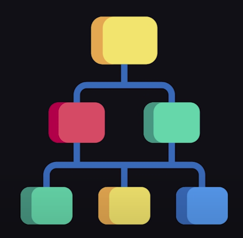

# useContext

Este hook me permite trabajar con la **API** de _Context_ de React.

## Context

Context: Mecanismo que me permite compartir informacion sin estar pasando los props.



Hagamos de cuenta que tenemos un objeto el cual almacena dos moods: feliz y triste.

```
const moods = {
    happy: ':)',
    sad: ':('
}
```

Si queremos compartir el mood actual a traves de componentes que no estan relacionados, podemos usar un _Context_

```
const MoodContext = createContext(moods);
```

Puede que una parte de la aplicacion este feliz, asi que usamos un **ContextProvider** para colocar el mood _feliz_ ahi. Por lo tanto, cada componente hijo que este adentro puede heredar ese valor sin necesidad de pasar los props al hijo.

```
function App(props) {
    return (
        <MoodContext.Provider value={moods.happy}>

        </MoodContext.Provider>
    )
}
```

## useContext Hook

Me permite acceder o consumir el valor actual del **ContextProvider** el cual puede que se encuentre muchos niveles mas arriba en el arbol de componentes.

Usar el useContext me evita tener que estar pasando props, lo cual no es tan practico como el hook ya que el valor debera pasar por muchos componentes hijos.

En caso de que el mood cambie de _feliz_ a _triste_ en el padre, los componentes hijos tambien recibiran esa actualizacion.

```
function MoodEmoji() {

    const mood = useContext(MoodContext);
    return <p> {mood} </p>
}
```

Es tambien recomendado utilizar el _Consumer_, basicamente, el **useContext** hook es un reemplazo del limpiador del consumer.

```
function MoodEmoji() {

    return <MoodContext.Consumer>
        {({mood}) => <p>{mood}</p>}
    </MoodContext.Consumer>
}
```
